# Automatización API con Rest Assured y Todo.ly 🚀

Proyecto de automatización de pruebas de API para [Todo.ly](https://todo.ly/), desarrollado con Java, JUnit 5, Rest Assured y Gradle.

## 🗂️ Estructura

```text
src/
├── test/java/
│   ├── basicJUnit/
│   ├── basicRestAssured/
│   ├── schemaValidator/
│   └── testTodolyApi/
│       └── CrudApi.java
└── test/resources/
	├── data/
	│   └── crud-todoly.csv
	└── schemas/
		├── createItemSchema.json
		└── createProjectSchema.json
```

## 🔄 Flujo de la prueba

El proyecto cuenta con una prueba end to end parametrizada que ejecuta el ciclo completo de un proyecto y un item por cada fila del archivo CSV:

```mermaid
flowchart
	csv[(crud-todoly.csv)] --> data["Fila parametrizada\n@CsvFileSource"]
	data --> auth["GET authentication/token.json\nObtener token"]

	subgraph project["📁 Ciclo del proyecto"]
		direction TB
		createProject["POST projects.json\nCrear proyecto"]
		updateProject["PUT projects/{projectId}.json\nActualizar proyecto"]
		readProject["GET projects/{projectId}.json\nConsultar proyecto"]
		projectChecks["✔ Status code\n✔ Content e Icon\n✔ JSON Schema"]
		createProject --> updateProject --> readProject --> projectChecks
	end

	subgraph item["📝 Ciclo del item"]
		direction TB
		createItem["POST items.json\nCrear item"]
		updateItem["PUT items/{itemId}.json\nActualizar item"]
		readItem["GET items/{itemId}.json\nConsultar item"]
		itemChecks["✔ ProjectId\n✔ Checked\n✔ LastCheckedDate\n✔ JSON Schema"]
		createItem --> updateItem --> readItem --> itemChecks
	end

	cleanupItem["DELETE items/{itemId}.json\nEliminar item"]
	cleanupProject["DELETE projects/{projectId}.json\nEliminar proyecto"]
	done(("Escenario finalizado"))

	auth --> createProject
	projectChecks --> createItem
	itemChecks --> cleanupItem --> cleanupProject --> done

	classDef input fill:#fff3cd,stroke:#d39e00,color:#5c4500,stroke-width:2px
	classDef auth fill:#d1ecf1,stroke:#0c7b93,color:#064653,stroke-width:2px
	classDef action fill:#d4edda,stroke:#2f855a,color:#1c4532,stroke-width:2px
	classDef check fill:#e2d9f3,stroke:#6f42c1,color:#3b216b,stroke-width:2px
	classDef cleanup fill:#f8d7da,stroke:#c53030,color:#63171b,stroke-width:2px
	classDef finish fill:#343a40,stroke:#212529,color:#ffffff,stroke-width:2px

	class csv,data input
	class auth auth
	class createProject,updateProject,readProject,createItem,updateItem,readItem action
	class projectChecks,itemChecks check
	class cleanupItem,cleanupProject cleanup
	class done finish
```




## 🧪 Prueba principal

La prueba está ubicada en:

```text
src/test/java/testTodolyApi/CrudApi.java
```

La clase utiliza `@ParameterizedTest` junto con `@CsvFileSource` para ejecutar un escenario completo por cada fila de:

```text
src/test/resources/data/crud-todoly.csv
```

Actualmente el CSV contiene tres escenarios. La primera fila contiene los nombres de las columnas y se omite con `numLinesToSkip = 1`.

### Datos parametrizados

| Columna | Uso |
| --- | --- |
| `cContentProject` | Contenido del proyecto nuevo |
| `cIconProject` | Icono del proyecto nuevo |
| `uContendProject` en el CSV / `uContentProject` en Java | Contenido actualizado del proyecto |
| `uIconProject` | Icono actualizado del proyecto |
| `cContentItem` | Contenido del item nuevo |
| `uContentItem` | Contenido actualizado del item |
| `uCheckedItem` | Estado final del item |
| `statusCode` | Código HTTP esperado |

## ✅ Validaciones implementadas

- Código HTTP esperado por escenario.
- Contenido e icono del proyecto.
- Contenido, proyecto asociado y estado del item.
- Campo `LastCheckedDate` no nulo.
- Campo `Deleted` igual a `true` al eliminar recursos.
- Validación de esquema JSON para proyectos e items.
- Tiempo de respuesta menor a 5 segundos.
- Logging completo de requests y responses mediante `.log().all()`.

## 🧰 Tecnologías

- Java 21
- Gradle Wrapper
- JUnit Jupiter 6
- Rest Assured 6
- JSON Schema Validator
- GitHub Actions

## ⚙️ Configuración local

La autenticación utiliza variables de entorno. Configúralas antes de ejecutar la prueba.

### PowerShell

```powershell
$env:USERNAME_TODOLY = "tu_usuario"
$env:PASSWORD_TODOLY = "tu_password"
```

No incluyas credenciales reales en el código, el CSV, el README ni en el repositorio.

## ▶️ Ejecución desde consola

Desde la raíz del proyecto:

```powershell
.\gradlew.bat test --tests testTodolyApi.CrudApi --rerun-tasks --console=plain
```

Para compilar solamente las pruebas:

```powershell
.\gradlew.bat compileTestJava
```

La configuración de Gradle muestra en consola los streams estándar de las pruebas, por lo que los logs de Rest Assured son visibles durante la ejecución.

## 🤖 GitHub Actions

El workflow se encuentra en:

```text
.github/workflows/workflow-api.yml
```

Se ejecuta en cada `push`, `pull_request` o manualmente mediante `workflow_dispatch`. El workflow:

- Configura Java 21.
- Usa el cache de Gradle.
- Inyecta las credenciales desde GitHub Secrets.
- Ejecuta exclusivamente `testTodolyApi.CrudApi`.

Antes de ejecutarlo, crea estos repository secrets en GitHub:

```text
USERNAME_TODOLY
PASSWORD_TODOLY
```

## 📈 Próximos pasos

- Añadir reportes HTML o Allure para consultar ejecuciones históricas.
- Separar datos positivos y negativos en diferentes archivos CSV.
- Agregar escenarios de errores de autenticación y validación.
- Publicar los reportes de ejecución como artifacts de GitHub Actions.
- Incorporar validaciones específicas para respuestas de eliminación de proyectos e items.