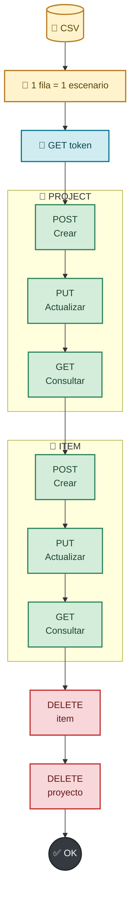

# 🧪 Grupo 3 - Taller 02
## Prueba CRUD end to end con Rest Assured

### 🎯 Implementación

| Elemento | Implementación |
| --- | --- |
| Clase | `src/test/java/testTodolyApi/CrudApi.java` |
| Framework | JUnit Jupiter + Gradle |
| Cliente HTTP | Rest Assured |
| Datos | `src/test/resources/data/crud-todoly.csv` |
| Contratos | JSON Schema Draft 4 |
| CI/CD | `.github/workflows/workflow-api.yml` |
| Escenarios | 3 filas CSV |

---

### 🧱 Patrón Rest Assured

```java
given()
    .header("Token", token)
    .body(payload.toString())
    .log().all()
.when()
    .post(endpoint)
.then()
    .log().all()
    .statusCode(statusCode)
    .body(...)
    .time(lessThan(5000L));
```

```text
Given  → headers + body + logging
When   → método HTTP + endpoint
Then   → status + body + schema + tiempo
```

---

### ⚙️ Variables de la clase

Estas variables centralizan la configuración, autenticación y validación de contratos utilizadas por `CrudApi`:

```java
private static String URL_BASE = "https://todo.ly/api";
private static String token;
private static String usuario;
private static String clave;
private static JsonSchemaFactory factory;
private static String pathSchemaProject = "schemas/createProjectSchema.json";
private static String pathSchemaItem = "schemas/createItemSchema.json";
```

| Variable | Uso dentro de la prueba |
| --- | --- |
| `URL_BASE` | Base común para construir los endpoints de Todo.ly. |
| `token` | Token obtenido en `@BeforeAll` y enviado en el header `Token`. |
| `usuario` | Usuario leído desde `USERNAME_TODOLY`. |
| `clave` | Contraseña leída desde `PASSWORD_TODOLY`. |
| `factory` | Fábrica configurada para validar JSON Schema Draft 4. |
| `pathSchemaProject` | Ruta del contrato JSON del proyecto. |
| `pathSchemaItem` | Ruta del contrato JSON del item. |

---

### 📊 Flujo implementado



---

### 🔢 Orden de ejecución

```text
@BeforeAll
    └── Obtener token

@ParameterizedTest: crudScenario
    ├── 1. POST /projects.json              → projectId
    ├── 2. PUT  /projects/{projectId}.json
    ├── 3. GET  /projects/{projectId}.json
    ├── 4. POST /items.json                 → itemId
    ├── 5. PUT  /items/{itemId}.json
    ├── 6. GET  /items/{itemId}.json
    ├── 7. DELETE /items/{itemId}.json
    └── 8. DELETE /projects/{projectId}.json
```

✅ El orden se garantiza porque todo el flujo está dentro del mismo método `crudScenario`.

---

### 🔐 Autenticación

```java
@BeforeAll
static void authenticationToken() {
    usuario = System.getenv("USERNAME_TODOLY");
    clave = System.getenv("PASSWORD_TODOLY");

    Response response = given()
            .auth().preemptive().basic(usuario, clave)
            .when()
            .get("https://todo.ly/api//authentication/token.json")
            .then()
            .statusCode(200)
            .extract().response();

    token = response.jsonPath().getString("TokenString");
}
```

```java
.header("Token", token)
```

Variables requeridas:

```text
USERNAME_TODOLY
PASSWORD_TODOLY
```

---

### 🧩 Parametrización CSV

```java
@CsvFileSource(
    resources = "/data/crud-todoly.csv",
    numLinesToSkip = 1
)
@ParameterizedTest
public void crudScenario(
        String cContentProject,
        int cIconProject,
        String uContentProject,
        int uIconProject,
        String cContentItem,
        String uContentItem,
        boolean uCheckedItem,
        int statusCode) {
```

📌 El CSV contiene **3 filas de datos**, por lo que JUnit ejecuta 3 escenarios completos.

```csv
Project Create GT,1,Project Update GT,3,Item GT,Item Update GT,true,200
Project A GT,4,Project B GT,5,Item A GT,Item B GT,true,200
Project X GT,2,Project Y GT,1,Item X GT,Item Y GT,true,200
```

| # | Dato | Uso |
| ---: | --- | --- |
| 1 | `cContentProject` | Proyecto inicial |
| 2 | `cIconProject` | Icono inicial |
| 3 | `uContendProject` | Proyecto actualizado |
| 4 | `uIconProject` | Icono actualizado |
| 5 | `cContentItem` | Item inicial |
| 6 | `uContentItem` | Item actualizado |
| 7 | `uCheckedItem` | Estado final |
| 8 | `statusCode` | HTTP esperado |

---

### 🔗 IDs dinámicos

```java
int projectId;
int itemId;

projectId = response.jsonPath().getInt("Id");
itemId = response.jsonPath().getInt("Id");
```

```text
Fila 1 → projectId + itemId → DELETE
Fila 2 → projectId + itemId → DELETE
Fila 3 → projectId + itemId → DELETE
```

Los IDs son locales a cada ejecución de `crudScenario`; cada item queda relacionado con su propio proyecto.


---

### 🧭 Clasificación de endpoints

| Categoría | Proyecto | Item |
| --- | --- | --- |
| 🚀 Creación | `POST /projects.json` | `POST /items.json` |
| 🔄 Actualización | `PUT /projects/{projectId}.json` | `PUT /items/{itemId}.json` |
| 🔎 Búsqueda | `GET /projects/{projectId}.json` | `GET /items/{itemId}.json` |
| 🗑️ Eliminación | `DELETE /projects/{projectId}.json` | `DELETE /items/{itemId}.json` |

---

### 🚀 Endpoints de creación

#### 📁 Crear proyecto — `POST /projects.json`

Construye el proyecto con los datos de la fila CSV y guarda el `Id` generado por Todo.ly para utilizarlo en las operaciones siguientes.

```java
payload.put("Content", cContentProject);
payload.put("Icon", cIconProject);

Response response = given()
    .header("Token", token)
    .body(payload.toString())
    .log().all()
.when()
    .post(URL_BASE + "/projects.json")
.then()
    .log().all()
    .statusCode(statusCode)
    .body("Content", equalTo(cContentProject))
    .body("Icon", equalTo(cIconProject))
        .matchesJsonSchemaInClasspath(pathSchemaProject)
        .using(factoryJson()))
    .time(lessThan(5000L))
    .extract().response();

projectId = response.jsonPath().getInt("Id");
```

✅ Validaciones aplicadas:

```text
HTTP status esperado
Content e Icon iguales al CSV
Estructura createProjectSchema.json
Tiempo de respuesta < 5000 ms
Id generado para relacionar el item
```

#### 📝 Crear item — `POST /items.json`

Construye un item y lo relaciona con el proyecto recién creado mediante `projectId`.

```java
payload = new JSONObject();
payload.put("Content", cContentItem);
payload.put("ProjectId", projectId);

response = given()
    .header("Token", token)
    .body(payload.toString())
    .log().all()
.when()
    .post(URL_BASE + "/items.json")
.then()
    .log().all()
    .statusCode(statusCode)
    .body("Content", equalTo(cContentItem))
    .body("ProjectId", equalTo(projectId))
    .body("Checked", equalTo(false))
    .body(JsonSchemaValidator
        .matchesJsonSchemaInClasspath(pathSchemaItem)
        .using(factoryJson()))
    .time(lessThan(5000L))
    .extract().response();

itemId = response.jsonPath().getInt("Id");
```

✅ Validaciones aplicadas:

```text
HTTP status esperado
Content igual al CSV
ProjectId igual al proyecto creado
Checked inicialmente en false
Estructura createItemSchema.json
Tiempo de respuesta < 5000 ms
Id generado para actualizar, consultar y eliminar
```

---

### 🔄 Endpoints de actualización

#### 📁 Proyecto: actualizar — `PUT /projects/{projectId}.json`

Actualiza el proyecto usando los datos de la misma fila del CSV.

```java
payload = new JSONObject();
payload.put("Content", uContentProject);
payload.put("Icon", uIconProject);

given()
    .header("Token", token)
    .body(payload.toString())
    .log().all()
.when()
    .put(URL_BASE + "/projects/" + projectId + ".json")
.then()
    .log().all()
    .statusCode(statusCode)
    .body("Content", equalTo(uContentProject))
    .body("Icon", equalTo(uIconProject))
    .body(JsonSchemaValidator.matchesJsonSchemaInClasspath(pathSchemaProject).using(factoryJson()))
    .time(lessThan(5000L));
```

✅ Valida status, `Content`, `Icon`, schema del proyecto y tiempo de respuesta.

### 🔎 Endpoints de búsqueda

#### 📁 Proyecto: buscar — `GET /projects/{projectId}.json`

Comprueba que los datos actualizados del proyecto fueron persistidos.

```java
given()
    .header("Token", token)
    .log().all()
.when()
    .get(URL_BASE + "/projects/" + projectId + ".json")
.then()
    .log().all()
    .statusCode(statusCode)
    .body("Content", equalTo(uContentProject))
    .body("Icon", equalTo(uIconProject))
    .time(lessThan(5000L));
```

✅ Valida status, `Content`, `Icon` y tiempo de respuesta.

### 🗑️ Endpoints de eliminación

#### 📁 Proyecto: eliminar — `DELETE /projects/{projectId}.json`

Elimina el proyecto al finalizar el escenario y evita dejar datos de prueba.

```java
given()
    .header("Token", token)
    .log().all()
.when()
    .delete(URL_BASE + "/projects/" + projectId + ".json")
.then()
    .log().all()
    .statusCode(statusCode)
    .body("Content", equalTo(uContentProject))
    .body("Icon", equalTo(uIconProject))
    .body("Deleted", equalTo(true))
    .time(lessThan(5000L));
```

✅ Valida status, datos del proyecto, `Deleted = true` y tiempo de respuesta.

### 🔄 Endpoint de actualización del item

#### 📝 Item: actualizar — `PUT /items/{itemId}.json`
Actualiza el contenido y el estado del item manteniendo su relación con el proyecto.
```java
payload = new JSONObject();
payload.put("Content", uContentItem);
payload.put("Checked", uCheckedItem);
payload.put("ProjectId", projectId);

given()
    .header("Token", token)
    .body(payload.toString())
    .log().all()
.when()
    .put(URL_BASE + "/items/" + itemId + ".json")
.then()
    .log().all()
    .statusCode(statusCode)
    .body("Content", equalTo(uContentItem))
    .body("ProjectId", equalTo(projectId))
    .body("Checked", equalTo(uCheckedItem))
    .body("LastCheckedDate", notNullValue())
    .body(JsonSchemaValidator.matchesJsonSchemaInClasspath(pathSchemaItem).using(factoryJson()))
    .time(lessThan(5000L));
```

✅ Valida `Content`, `ProjectId`, `Checked`, `LastCheckedDate`, schema, status y tiempo.

### 🔎 Endpoint de búsqueda del item

#### 📝 Item: buscar — `GET /items/{itemId}.json`

Comprueba que los datos actualizados del item fueron persistidos.

```java
given()
    .header("Token", token)
    .log().all()
.when()
    .get(URL_BASE + "/items/" + itemId + ".json")
.then()
    .log().all()
    .statusCode(statusCode)
    .body("Content", equalTo(uContentItem))
    .body("ProjectId", equalTo(projectId))
    .body("Checked", equalTo(uCheckedItem))
    .body("LastCheckedDate", notNullValue())
    .body(JsonSchemaValidator.matchesJsonSchemaInClasspath(pathSchemaItem).using(factoryJson()))
    .time(lessThan(5000L));
```

✅ Valida `Content`, `ProjectId`, `Checked`, `LastCheckedDate`, schema, status y tiempo.

### 🗑️ Endpoint de eliminación del item

#### 📝 Item: eliminar — `DELETE /items/{itemId}.json`

Elimina el item y confirma que la API lo marque como eliminado.

```java
given()
    .header("Token", token)
    .log().all()
.when()
    .delete(URL_BASE + "/items/" + itemId + ".json")
.then()
    .log().all()
    .statusCode(statusCode)
    .body("Content", equalTo(uContentItem))
    .body("ProjectId", equalTo(projectId))
    .body("Checked", equalTo(uCheckedItem))
    .body("LastCheckedDate", notNullValue())
    .body("Deleted", equalTo(true))
    .body(JsonSchemaValidator.matchesJsonSchemaInClasspath(pathSchemaItem).using(factoryJson()))
    .time(lessThan(5000L));
```

✅ Valida los datos del item, `LastCheckedDate`, `Deleted = true`, schema, status y tiempo.

---

### 📋 JSON Schema

```text
src/test/resources/schemas/createProjectSchema.json
src/test/resources/schemas/createItemSchema.json
```

#### 📁 Schema del proyecto

```json
{
    "$schema": "http://json-schema.org/draft-04/schema#",
    "type": "object",
    "required": ["Id", "Content", "ItemsCount", "Icon", "ItemType", "ParentId", "Collapsed", "ItemOrder", "Children", "IsProjectShared", "ProjectShareOwnerName", "ProjectShareOwnerEmail", "IsShareApproved", "IsOwnProject", "LastSyncedDateTime", "LastUpdatedDate", "Deleted", "SyncClientCreationId"],
    "properties": {
        "Id": { "type": "integer", "minimum": 1 },
        "Content": { "type": "string", "minLength": 1 },
        "ItemsCount": { "type": "integer", "minimum": 0 },
        "Icon": { "type": "integer", "minimum": 0 },
        "ItemType": { "type": "integer" },
        "ParentId": { "type": ["integer", "null"] },
        "Collapsed": { "type": "boolean" },
        "ItemOrder": { "type": "integer" },
        "Children": { "type": "array" },
        "IsProjectShared": { "type": "boolean" },
        "ProjectShareOwnerName": { "type": ["string", "null"] },
        "ProjectShareOwnerEmail": { "type": ["string", "null"] },
        "IsShareApproved": { "type": "boolean" },
        "IsOwnProject": { "type": "boolean" },
        "LastSyncedDateTime": { "type": "string" },
        "LastUpdatedDate": { "type": "string" },
        "Deleted": { "type": "boolean" },
        "SyncClientCreationId": { "type": ["string", "null"] }
    }
}
```

#### 📝 Schema del item

```json
{
    "$schema": "http://json-schema.org",
    "id": "http://json-schema.org",
    "type": "object",
    "required": ["Id", "Content", "ItemType", "Checked", "ProjectId", "ParentId", "Path", "Collapsed", "DateString", "DateStringPriority", "DueDate", "Recurrence", "ItemOrder", "Priority", "LastSyncedDateTime", "Children", "CreatedDate", "LastCheckedDate", "LastUpdatedDate", "Deleted"],
    "properties": {
        "Id": { "type": "number" },
        "Content": { "type": ["string", "null"] },
        "ItemType": { "type": "number" },
        "Checked": { "type": ["boolean", "null"] },
        "ProjectId": { "type": ["number", "null"] },
        "ParentId": { "type": ["number", "null"] },
        "Path": { "type": ["string", "null"] },
        "Collapsed": { "type": ["boolean", "null"] },
        "DateString": { "type": ["string", "null"] },
        "DateStringPriority": { "type": "number" },
        "DueDate": { "type": ["string", "null"] },
        "Recurrence": { "type": ["object", "null"] },
        "ItemOrder": { "type": ["number", "null"] },
        "Priority": { "type": ["number", "null"] },
        "LastSyncedDateTime": { "type": ["string", "null"] },
        "Children": { "type": "array", "items": { "$ref": "#" } },
        "CreatedDate": { "type": ["string", "null"] },
        "LastCheckedDate": { "type": ["string", "null"] },
        "LastUpdatedDate": { "type": ["string", "null"] },
        "Deleted": { "type": ["boolean", "null"] }
    }
}
```

#### 🔎 Aplicación en Rest Assured

```java
.body(JsonSchemaValidator
    .matchesJsonSchemaInClasspath(pathSchemaProject)
    .using(factoryJson()))

.body(JsonSchemaValidator
        .matchesJsonSchemaInClasspath(pathSchemaItem)
        .using(factoryJson()))
```

La fábrica utiliza `SchemaVersion.DRAFTV4` para validar estructura, tipos y campos obligatorios.

---

### ▶️ Ejecución local

```powershell
$env:USERNAME_TODOLY = "tu_usuario"
$env:PASSWORD_TODOLY = "tu_password"

.\gradlew.bat test `
    --tests testTodolyApi.CrudApi `
    --rerun-tasks `
    --console=plain
```

```powershell
.\gradlew.bat compileTestJava
```

---

### 🤖 GitHub Actions

```text
.github/workflows/workflow-api.yml
```

```yaml
env:
  USERNAME_TODOLY: ${{ secrets.USERNAME_TODOLY }}
  PASSWORD_TODOLY: ${{ secrets.PASSWORD_TODOLY }}
```

```bash
./gradlew test --tests testTodolyApi.CrudApi --rerun-tasks --console=plain
```

🚦 Eventos configurados:

```text
push · pull_request · workflow_dispatch
```

---

### 🏁 Criterio de aprobación

```text
3 filas CSV
×
8 operaciones CRUD por fila
×
Validaciones HTTP + Body + Schema + Tiempo
↓
Prueba end to end satisfactoria ✅
```

## 👨‍💻 Autores

|GRUPO|NOMBRES|E-MAIL PERSONAL|CELULAR / FIJO|
|-----|-------|---------------|--------------|
|3    |Geanmarcos Antonio Tataje Tipacti | geanmarcos.tataje@gmail.com|977813686|
|3    |Hector Alonso Aguilar Figueroa | alonsoaguilarfi@gmail.com|957993069|
|3    |Carmen Rosa Sosa Quispe | carmenrosasosaquispe@gmail.com|953848583|
|3    |Mischell Sonia Huchani Huchani | gmischell.huchani14@gmail.com|591 76226442|